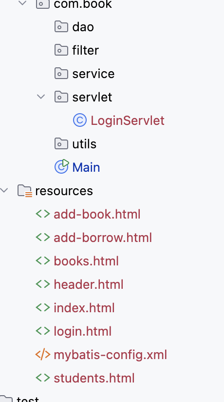
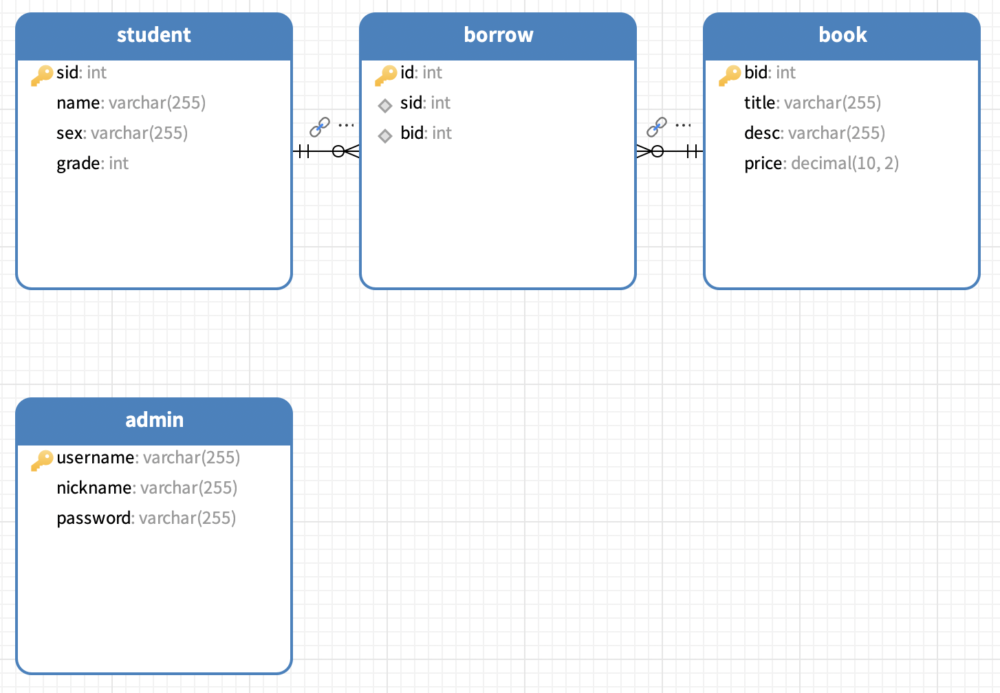
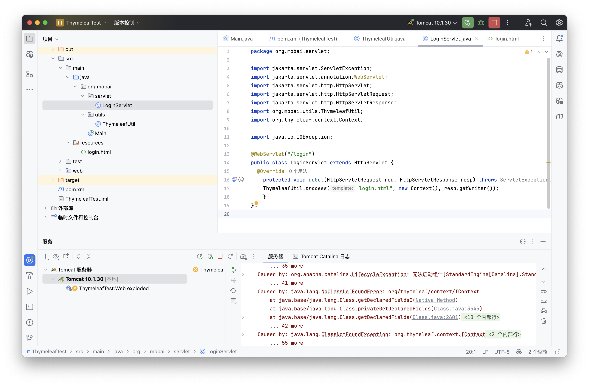
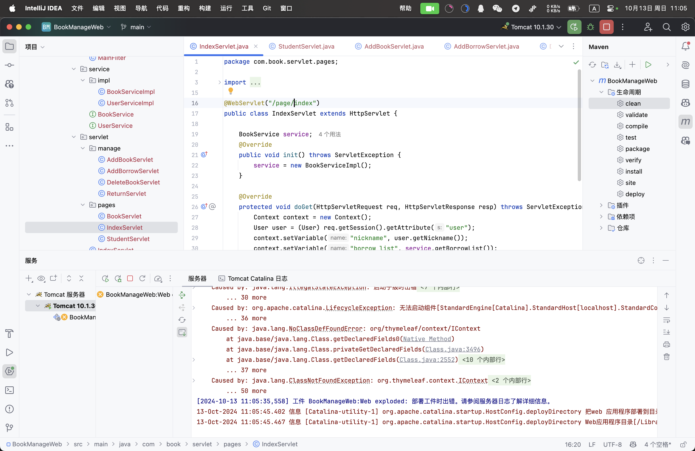
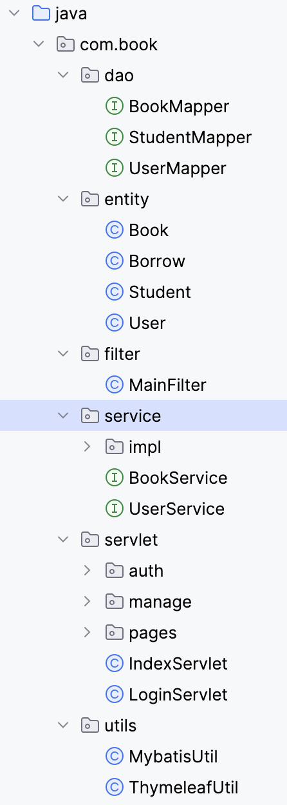
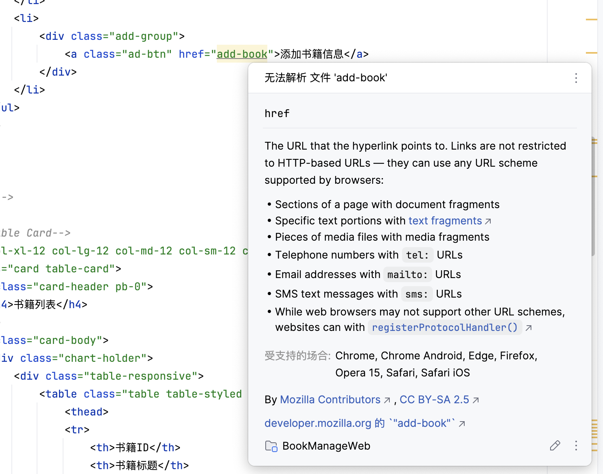
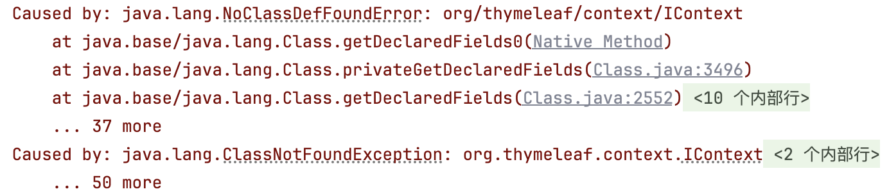

# sBook_Manage_Web
图书馆管理系统，带web页面

> 前端模版是真的难找啊，大部分是收费的，免费的已经是凤毛麟角了。
>
> Copyright 2021 © SplashDash All Rights By [bootstrapmb](http://www.bootstrapmb.com/).
>
> 额，好像本身就是付费模版

技术栈：

- Mybaits
- Servlet
- Thymeleaf
- Tomcat

> 将数据库查询的操作和结构融入到前端页面中

## 1.前端模版资源寻找

从教学中的资源将前端页面拉取过来，按照相同的路径保存即可。

启动Tomcat，代理下webapp中的静态页面查看效果。



放到resources目录下实现Servlet直接代理相关页面

## 2.创建数据库

直接使用之前的数据库book_manage添加admin表即可

一次选择多张表即可可以一次将多个表转换为模型



## 3.编写初始Servlet实现直接代理静态网页

编写的LoginServlet如下：

```java
package org.mobai.servlet;

import jakarta.servlet.ServletException;
import jakarta.servlet.annotation.WebServlet;
import jakarta.servlet.http.HttpServlet;
import jakarta.servlet.http.HttpServletRequest;
import jakarta.servlet.http.HttpServletResponse;
import org.mobai.utils.ThymeleafUtil;
import org.thymeleaf.context.Context;

import java.io.IOException;

@WebServlet("/login")
public class LoginServlet extends HttpServlet {
  @Override
    protected void doGet(HttpServletRequest req, HttpServletResponse resp) throws ServletException, IOException {
    ThymeleafUtil.process("login.html", new Context(), resp.getWriter());
    }
}
```

问题如下：



> Java类资源找不到

即使单独添加lib到库依旧报错

> 像这种初始即报错算是一种痛苦了
>
> 尝试了多种方式问题依旧

## 4.移植项目依旧报错



> 依旧找不到类，发生同样的异常。

项目结构如下：

src

```bash
.
├── java
│   └── com
│       └── book
│           ├── dao															-- 数据库操作映射接口
│           │   ├── BookMapper.java	
│           │   ├── StudentMapper.java
│           │   └── UserMapper.java
│           ├── entity													-- 数据库实体模型
│           │   ├── Book.java
│           │   ├── Borrow.java
│           │   ├── Student.java
│           │   └── User.java
│           ├── filter													-- 资源过滤器
│           │   └── MainFilter.java
│           ├── service												  -- 业务逻辑层和实现	
│           │   ├── BookService.java
│           │   ├── UserService.java         
│           │   └── impl         
│           │       ├── BookServiceImpl.java
│           │       └── UserServiceImpl.java
│           ├── servlet													-- servlet功能，这里调用dao中的方法
│           │   ├── IndexServlet.java
│           │   ├── LoginServlet.java
│           │   ├── auth
│           │   │   ├── LoginServlet.java
│           │   │   └── LogoutServlet.java
│           │   ├── manage
│           │   │   ├── AddBookServlet.java
│           │   │   ├── AddBorrowServlet.java
│           │   │   ├── DeleteBookServlet.java
│           │   │   └── ReturnServlet.java
│           │   └── pages
│           │       ├── BookServlet.java
│           │       ├── IndexServlet.java
│           │       └── StudentServlet.java
│           └── utils                						-- 工件
│               ├── MybatisUtil.java
│               └── ThymeleafUtil.java
└── resources
    ├── add-book.html
    ├── add-borrow.html
    ├── books.html
    ├── header.html
    ├── index.html
    ├── login.html
    ├── mybatis-config.xml
    └── students.html
```

web下项目结构如下：

```bash
.
├── WEB-INF
├── lib
└── static
    ├── css
    ├── font
    ├── image
    ├── js
    └── picture
```

> 教学视频还是可以看一下，不然还是不太理解Service这个包的作用

项目架构依旧跑不起来，暂且搁置了。

解释下java中final的基本用法：

- **`final` 类**：不能被继承。
- **`final` 方法**：不能被重写。
- **`final` 变量**：只能被赋值一次。
- **`final` 引用类型**：引用本身不能改变，但引用的对象内容可以改变。

关于第四点比如创建了一个List<Interger>ml;

那么不管在什么方法中ml的地址不能改变，即引用对象不发生改变，但是其内部是可以使用add函数添加内容的。


通过更多的了解，发现这种情可能是因为依赖导入的先后顺序有关。

像Thymeleaf应该最先跑起来。


## 5.restart



随着自己的深入学习，回过头来发现这些架构师真的简单啊。

> 是啊，学而不思则罔，思而不学则殆。

把项目部分内容移植出去，重新重新构建吧。

实际上项目修改起来依旧比较麻烦。这里只重新检索构造一下。

下面整理代码架构。

### dao

#### BookMapper.java

```java
package com.book.dao;

import com.book.entity.Book;
import com.book.entity.Borrow;
import org.apache.ibatis.annotations.*;

import java.util.List;

public interface BookMapper {

    // 注意这里手动指定映射出来的字段名称。
    @Results({
            @Result(column = "id", property = "id"),
            @Result(column = "bid", property = "book_id"),
            @Result(column = "title", property = "book_name"),
            @Result(column = "time", property = "time"),
            @Result(column = "name", property = "student_name"),
            @Result(column = "sid", property = "student_id")
    })
    @Select("select * from borrow, student, book where borrow.bid = book.bid and student.sid = borrow.sid")
    List<Borrow> getBorrowList();

    @Insert("insert into borrow(sid, bid, time) values(#{sid}, #{bid}, NOW())")
    void addBorrow(@Param("sid") int sid, @Param("bid") int bid);

    @Delete("delete from borrow where id = #{id}")
    void deleteBorrow(String id);

    @Select("select * from book")
    List<Book> getBookList();

    @Select("delete from book where bid = #{bid}")
    void deleteBook(int bid);

    @Insert("insert into book(title, `desc`, price) values(#{title}, #{desc}, #{price})")
    void addBook(@Param("title") String title,@Param("desc") String desc,@Param("price") double price);
}
```

> 注意上面多参数的注入/指定方法
>
> 数据库的操作实现这里不再赘述了。

- getBorrowList
- addBorrow
- deleteBorrow
- getBookList
- deleteBook
- addBook

这里采用的方式是：mybaits-config.xml  <--  MybatisUtil


####  StudentMapper.java

```java
package com.book.dao;

import com.book.entity.Student;
import org.apache.ibatis.annotations.Select;

import java.util.List;

public interface StudentMapper {
    @Select("select * from student")
    List<Student> getStudentList();
}
```

- getStudent

这个是在BookServiceImpl中得到了使用和实现


#### UserMapper.java

```java
package com.book.dao;

import com.book.entity.User;
import org.apache.ibatis.annotations.Param;
import org.apache.ibatis.annotations.Select;

public interface UserMapper {

    @Select("select * from admin where username = #{username} and password = #{password}")
    User getUser(@Param("username") String username, @Param("password") String password);
}
```

- getUser

上面三个Mapper简单来说就是数据库操作和映射而已，配合下面的entity


### entity

#### Book.java

```java
package com.book.entity;

import lombok.Data;

@Data
public class Book {
    int bid;
    String title;
    String desc;
    double price;
}
```

书籍实体，不赘述。desc这个字段记得加上飘号。


#### Borrow.java

```java
package com.book.entity;

import lombok.Data;

import java.util.Date;

@Data
public class Borrow {
    int id;
    int book_id;
    String book_name;
    Date time;
    String student_name;
    int student_id;
}
```

> 注意这里数据库字段的名称和实体类的字段的名称。


#### Student.java

```java
package com.book.entity;

import lombok.Data;

@Data
public class Student {
    int sid;
    String name;
    String sex;
    int grade;
}
```

学生实体，不赘述。


#### User.java

```java
package com.book.entity;

import lombok.Data;

@Data
public class User {
    int id;
    String username;
    String nickname;
    String password;
}
```

用户实体，不赘述。


### filter

#### MainFilter.java

```java
package com.book.filter;

import com.book.entity.User;
import jakarta.servlet.FilterChain;
import jakarta.servlet.ServletException;
import jakarta.servlet.annotation.WebFilter;
import jakarta.servlet.http.HttpFilter;
import jakarta.servlet.http.HttpServletRequest;
import jakarta.servlet.http.HttpServletResponse;
import jakarta.servlet.http.HttpSession;

import java.io.IOException;

@WebFilter("/*")
public class MainFilter extends HttpFilter {

    @Override
    protected void doFilter(HttpServletRequest req, HttpServletResponse res, FilterChain chain) throws IOException, ServletException {
        String url = req.getRequestURL().toString();
        if(!url.contains("/static/") && !url.endsWith("login")){
            HttpSession session = req.getSession();
            User user  = (User) session.getAttribute("user");
            if(user == null) {
                res.sendRedirect("login");
                return;
            }
        }
        chain.doFilter(req, res);
    }
}
```

作用于根上下文的过滤作用，禁止访问部分静态资源，以及微登陆状态就直接导向到/login

登陆判断原理是：session


### Service

#### Impl

##### BookServiceImpl.java

```java
package com.book.service.impl;

import com.book.dao.BookMapper;
import com.book.dao.StudentMapper;
import com.book.dao.UserMapper;
import com.book.entity.Book;
import com.book.entity.Borrow;
import com.book.entity.Student;
import com.book.entity.User;
import com.book.service.BookService;
import com.book.utils.MybatisUtil;
import org.apache.ibatis.session.SqlSession;

import java.util.*;
import java.util.stream.Collectors;

public class BookServiceImpl implements BookService {

    @Override
    public List<Borrow> getBorrowList() {
        try (SqlSession sqlSession = MybatisUtil.getSession()){
            BookMapper mapper = sqlSession.getMapper(BookMapper.class);
            return mapper.getBorrowList();
        }
    }

    @Override
    public void returnBook(String id) {
        try (SqlSession sqlSession = MybatisUtil.getSession()){
            BookMapper mapper = sqlSession.getMapper(BookMapper.class);
            mapper.deleteBorrow(id);
        }
    }

    @Override
    public List<Book> getActiveBookList() {
        Set<Integer> set = new HashSet<>();
        this.getBorrowList().forEach(borrow -> set.add(borrow.getBook_id()));
        // 先获取哪些书的id在borrow中出现了
        try (SqlSession sqlSession = MybatisUtil.getSession()){
            BookMapper mapper = sqlSession.getMapper(BookMapper.class);
            return mapper.getBookList()
                    .stream()
                    .filter(book -> !set.contains(book.getBid()))
                    .collect(Collectors.toList());
        }
        // 然后这里是获取哪些书的id在borrow中没有出现，得到的结果就是未被借出的书，注意这种流式操作的写法
        // 这里的stream()方法是将List转换为Stream，filter()方法是过滤，collect()方法是将Stream转换为List
        // strem -> filter -> collect 这个流程是很常见的，可以记住
    }

    @Override
    public Map<Book, Boolean> getBookList() {
        Set<Integer> set = new HashSet<>();
        this.getBorrowList().forEach(borrow -> set.add(borrow.getBook_id()));
        try (SqlSession sqlSession = MybatisUtil.getSession()){
            Map<Book, Boolean> map = new LinkedHashMap<>();
            BookMapper mapper = sqlSession.getMapper(BookMapper.class);
            mapper.getBookList().forEach(book -> map.put(book, set.contains(book.getBid())));
            return map;
        }
    }

    @Override
    public List<Student> getStudentList() {
        try (SqlSession sqlSession = MybatisUtil.getSession()){
            StudentMapper mapper = sqlSession.getMapper(StudentMapper.class);
            return mapper.getStudentList();
        }
    }

    @Override
    public void addBorrow(int sid, int bid) {
        try (SqlSession sqlSession = MybatisUtil.getSession()){
            BookMapper mapper = sqlSession.getMapper(BookMapper.class);
            mapper.addBorrow(sid, bid);
        }
    }

    @Override
    public void deleteBook(int bid) {
        try (SqlSession sqlSession = MybatisUtil.getSession()){
            BookMapper mapper = sqlSession.getMapper(BookMapper.class);
            mapper.deleteBook(bid);
        }
    }

    @Override
    public void addBook(String title, String desc, double price) {
        try (SqlSession sqlSession = MybatisUtil.getSession()){
            BookMapper mapper = sqlSession.getMapper(BookMapper.class);
            mapper.addBook(title, desc, price);
        }
    }
}
```

用MybaitsUtil直接获取mapper，然后直接继承下面的Service直接实现即可。没啥问题和难度，数据库的映射关系都直接靠Mybatis直接实现了。

有数据库信息获取，有实体，有对象，那么交给前端处理就好了。某种程度来说，这种按照模版进行的操作确实比较“简单”呢？


##### UserServiceImpl.java

```java
package com.book.service.impl;

import com.book.dao.UserMapper;
import com.book.entity.User;
import com.book.service.UserService;
import com.book.utils.MybatisUtil;
import jakarta.servlet.http.HttpSession;
import org.apache.ibatis.session.SqlSession;

public class UserServiceImpl implements UserService {

    @Override
    public boolean auth(String username, String password, HttpSession session) {
        try (SqlSession sqlSession = MybatisUtil.getSession()){
            UserMapper mapper = sqlSession.getMapper(UserMapper.class);
            User user = mapper.getUser(username, password);
            if(user == null) return false;
            session.setAttribute("user", user);
            return true;
        }
    }
}
```

注意这个实现，如果说上面的那个BookServiceImpl.java的实现是获取数据库对象，那么这个实现除了获取数据库对象还多了一个校验返回信息。

如果这个User在数据库中处在，那么返回true并且给session设置attribute。

session.setAttribute


#### BookService.java

```java
package com.book.service;

import com.book.entity.Book;
import com.book.entity.Borrow;
import com.book.entity.Student;

import java.util.List;
import java.util.Map;

public interface BookService {
    List<Borrow> getBorrowList();
    void returnBook(String id);
    List<Book> getActiveBookList();
    List<Student> getStudentList();
    void addBorrow(int sid, int bid);
    Map<Book, Boolean> getBookList();
    void deleteBook(int bid);
    void addBook(String title, String desc, double price);
}
```

这里的函数名称和BookMapper里面的函数名称一致，也就是创建接口，再给实现类通过调用Mapper来实现。


#### UserService.java

```java
package com.book.service;

import jakarta.servlet.http.HttpSession;

public interface UserService {
    boolean auth(String username, String password, HttpSession session);
}
```

注意函数名是auth


> 上面可以独立出去，看作是数据库操作和对象/实体获取。下面就是面向前端的部分了。这样看的话就比较简单了。思路也比较清晰

### Servlet

> 是应该先看下面的Util工具类。

#### auth

##### LoginServlet.java

```java
package com.book.servlet.auth;

import com.book.service.UserService;
import com.book.service.impl.UserServiceImpl;
import com.book.utils.MybatisUtil;
import com.book.utils.ThymeleafUtil;
import jakarta.servlet.ServletException;
import jakarta.servlet.annotation.WebServlet;
import jakarta.servlet.http.Cookie;
import jakarta.servlet.http.HttpServlet;
import jakarta.servlet.http.HttpServletRequest;
import jakarta.servlet.http.HttpServletResponse;
import org.apache.ibatis.session.SqlSession;
import org.thymeleaf.context.Context;

import java.io.IOException;

@WebServlet("/login")
public class LoginServlet extends HttpServlet {

    UserService service;
    @Override
    public void init() throws ServletException {
        service = new UserServiceImpl();
    }

    @Override
    protected void doGet(HttpServletRequest req, HttpServletResponse resp) throws ServletException, IOException {
        Cookie[] cookies = req.getCookies();
        if(cookies != null){
            String username = null;
            String password = null;
            for (Cookie cookie : cookies) {
                if(cookie.getName().equals("username")) username = cookie.getValue();
                if(cookie.getName().equals("password")) password = cookie.getValue();
            }
            if(username != null && password != null){
                if(service.auth(username, password, req.getSession())){
                    resp.sendRedirect("index");
                    return;
                }
            }
        }
        Context context = new Context();
        if(req.getSession().getAttribute("login-failure") != null){
            context.setVariable("failure", true);
            req.getSession().removeAttribute("login-failure");
        }
      	// 将POST请求中的login-failure继续清除掉
        if(req.getSession().getAttribute("user") != null) {
            resp.sendRedirect("index");
            return;
        }
        ThymeleafUtil.process("login.html", context, resp.getWriter());
    }

    @Override
    protected void doPost(HttpServletRequest req, HttpServletResponse resp) throws ServletException, IOException {
        String username = req.getParameter("username");
        String password = req.getParameter("password");
        String remember = req.getParameter("remember-me");
        if(service.auth(username, password, req.getSession())){
            if(remember != null){
                Cookie cookie_username = new Cookie("username", username);
                cookie_username.setMaxAge(60 * 60 * 24 * 7);
                // 60s * 60min * 24h * 7day  --> 7天
                Cookie cookie_password = new Cookie("password", password);
                cookie_password.setMaxAge(60 * 60 * 24 * 7);
                resp.addCookie(cookie_username);
                resp.addCookie(cookie_password);
                // 设置cookie
            }
            resp.sendRedirect("index");
            // 校验成功，重定向到index
        }else {
            req.getSession().setAttribute("login-failure", new Object());
            // 校验失败，添加login-failure附带值，传递到doGet方法中
            this.doGet(req, resp);
        }
    }
}
```

这里只用了UserService，其实现就是判断user是否存在然后设置session.setAttribute，其内部的Servlet实现可以再多多仔细看一看。

- init()
  - 初始化，创建一个service对象（UserServiceImpl）
- doGet()
  - cookie检验
  - attribute清除
- doPost()
  - 登陆数据库检验
  - 添加attribute


##### LogoutServlet.java

```java
package com.book.servlet.auth;

import jakarta.servlet.ServletException;
import jakarta.servlet.annotation.WebServlet;
import jakarta.servlet.http.Cookie;
import jakarta.servlet.http.HttpServlet;
import jakarta.servlet.http.HttpServletRequest;
import jakarta.servlet.http.HttpServletResponse;

import java.io.IOException;

@WebServlet("/logout")
public class LogoutServlet extends HttpServlet {
    @Override
    protected void doGet(HttpServletRequest req, HttpServletResponse resp) throws ServletException, IOException {
        req.getSession().removeAttribute("user");
        Cookie cookie_username = new Cookie("username", "username");
        cookie_username.setMaxAge(0);
        Cookie cookie_password = new Cookie("password", "password");
        cookie_password.setMaxAge(0);
        resp.addCookie(cookie_username);
        resp.addCookie(cookie_password);
        resp.sendRedirect("login");
    }
}
```

清除cookie信息而已。


#### manage

##### AddBookServlet.java

```java
package com.book.servlet.manage;

import com.book.service.BookService;
import com.book.service.impl.BookServiceImpl;
import com.book.utils.ThymeleafUtil;
import jakarta.servlet.ServletException;
import jakarta.servlet.annotation.WebServlet;
import jakarta.servlet.http.HttpServlet;
import jakarta.servlet.http.HttpServletRequest;
import jakarta.servlet.http.HttpServletResponse;
import org.thymeleaf.context.Context;

import java.io.IOException;

@WebServlet("/add-book")
public class AddBookServlet extends HttpServlet {

    BookService service;
    @Override
    public void init() throws ServletException {
        service = new BookServiceImpl();
    }

    @Override
    protected void doGet(HttpServletRequest req, HttpServletResponse resp) throws ServletException, IOException {
        ThymeleafUtil.process("add-book.html", new Context(), resp.getWriter());
    }


    @Override
    protected void doPost(HttpServletRequest req, HttpServletResponse resp) throws ServletException, IOException {
        String title = req.getParameter("title");
        String desc = req.getParameter("desc");
        double price = Double.parseDouble(req.getParameter("price"));
        service.addBook(title, desc, price);
        resp.sendRedirect("books");
    }
}
```

- init()
  - 创建service对象（BookServieImpl）
- doGet()
  - 处理get请求，定向到add-book.html上
  - 处理post请求，调用service，添加书籍。

添加书籍操作的接口实现。


##### AddBorrowServlet.java

```java
package com.book.servlet.manage;

import com.book.service.BookService;
import com.book.service.impl.BookServiceImpl;
import com.book.utils.ThymeleafUtil;
import jakarta.servlet.ServletException;
import jakarta.servlet.annotation.WebServlet;
import jakarta.servlet.http.HttpServlet;
import jakarta.servlet.http.HttpServletRequest;
import jakarta.servlet.http.HttpServletResponse;
import org.thymeleaf.context.Context;

import java.io.IOException;

@WebServlet("/add-borrow")
public class AddBorrowServlet extends HttpServlet {

    BookService service;
    @Override
    public void init() throws ServletException {
        service = new BookServiceImpl();
    }

    @Override
    protected void doGet(HttpServletRequest req, HttpServletResponse resp) throws ServletException, IOException {
        Context context = new Context();
        context.setVariable("book_list", service.getActiveBookList());
        context.setVariable("student_list", service.getStudentList());
        ThymeleafUtil.process("add-borrow.html", context, resp.getWriter());
    }

    @Override
    protected void doPost(HttpServletRequest req, HttpServletResponse resp) throws ServletException, IOException {
        int sid = Integer.parseInt(req.getParameter("student"));
        int bid = Integer.parseInt(req.getParameter("book"));
        service.addBorrow(sid, bid);
        resp.sendRedirect("index");
    }
}
```

- init()
  - 创建service
- doGet()
  - get请求的时候先是获取基本信息，作为变量储存起来
  - 然后页面定向到add-borrow.html
- doPost()
  - 调用接口，添加书籍，然后重定向到index主页

`context.setVariable` 是 Thymeleaf 模板引擎中的一个方法，用于在模板上下文中设置变量。

##### DeleteBook.java

```java
package com.book.servlet.manage;

import com.book.service.BookService;
import com.book.service.impl.BookServiceImpl;
import jakarta.servlet.ServletException;
import jakarta.servlet.annotation.WebServlet;
import jakarta.servlet.http.HttpServlet;
import jakarta.servlet.http.HttpServletRequest;
import jakarta.servlet.http.HttpServletResponse;

import java.io.IOException;

@WebServlet("/delete-book")
public class DeleteBookServlet extends HttpServlet {

    BookService service;
    @Override
    public void init() throws ServletException {
        service = new BookServiceImpl();
    }

    @Override
    protected void doGet(HttpServletRequest req, HttpServletResponse resp) throws ServletException, IOException {
        int bid = Integer.parseInt(req.getParameter("bid"));
        service.deleteBook(bid);
        resp.sendRedirect("books");
    }
}
```

- init()
- doGet()
  - 调用接口，处理get请求，删除书籍信息


##### ReturnSerlvet.java

```java
package com.book.servlet.manage;

import com.book.service.BookService;
import com.book.service.impl.BookServiceImpl;
import jakarta.servlet.ServletException;
import jakarta.servlet.annotation.WebServlet;
import jakarta.servlet.http.HttpServlet;
import jakarta.servlet.http.HttpServletRequest;
import jakarta.servlet.http.HttpServletResponse;

import java.io.IOException;

@WebServlet("/return-book")
public class ReturnServlet extends HttpServlet {

    BookService service;
    @Override
    public void init() throws ServletException {
        service = new BookServiceImpl();
    }

    @Override
    protected void doGet(HttpServletRequest req, HttpServletResponse resp) throws ServletException, IOException {
        String id = req.getParameter("id");
        service.returnBook(id);
        resp.sendRedirect("index");
    }
}
```

- init()
- doGet()
  - 通过传递的id直接调用service


#### pages

##### BookServlet.java

```java
package com.book.servlet.pages;

import com.book.entity.User;
import com.book.service.BookService;
import com.book.service.impl.BookServiceImpl;
import com.book.utils.ThymeleafUtil;
import jakarta.servlet.ServletException;
import jakarta.servlet.annotation.WebServlet;
import jakarta.servlet.http.HttpServlet;
import jakarta.servlet.http.HttpServletRequest;
import jakarta.servlet.http.HttpServletResponse;
import org.thymeleaf.context.Context;

import java.io.IOException;
import java.util.ArrayList;

@WebServlet("/books")
public class BookServlet extends HttpServlet {

    BookService service;
    @Override
    public void init() throws ServletException {
        service = new BookServiceImpl();
    }

    @Override
    protected void doGet(HttpServletRequest req, HttpServletResponse resp) throws ServletException, IOException {
        Context context = new Context();
        User user = (User) req.getSession().getAttribute("user");
        context.setVariable("nickname", user.getNickname());
        context.setVariable("book_list", service.getBookList().keySet());
        context.setVariable("book_list_status", new ArrayList<>(service.getBookList().values()));
        ThymeleafUtil.process("books.html", context, resp.getWriter());
    }
}
```

- init()
  - 创建service
- doGet()
  - 调用接口添加context信息
  - 定向到books.html


##### IndexServlet.java

```java
package com.book.servlet.pages;

import com.book.entity.User;
import com.book.service.BookService;
import com.book.service.impl.BookServiceImpl;
import com.book.utils.ThymeleafUtil;
import jakarta.servlet.ServletException;
import jakarta.servlet.annotation.WebServlet;
import jakarta.servlet.http.HttpServlet;
import jakarta.servlet.http.HttpServletRequest;
import jakarta.servlet.http.HttpServletResponse;
import org.thymeleaf.context.Context;

import java.io.IOException;

@WebServlet("/index")
public class IndexServlet extends HttpServlet {

    BookService service;
    @Override
    public void init() throws ServletException {
        service = new BookServiceImpl();
    }

    @Override
    protected void doGet(HttpServletRequest req, HttpServletResponse resp) throws ServletException, IOException {
        Context context = new Context();
        User user = (User) req.getSession().getAttribute("user");
        context.setVariable("nickname", user.getNickname());
        context.setVariable("borrow_list", service.getBorrowList());
        context.setVariable("book_count", service.getBookList().size());
        context.setVariable("student_count", service.getStudentList().size());
        ThymeleafUtil.process("index.html", context, resp.getWriter());
    }
}
```

- init()
  - 创建service
- doGet()
  - 处理信息，传递context


##### StudentServlet.java

```java
package com.book.servlet.pages;

import com.book.entity.User;
import com.book.service.BookService;
import com.book.service.impl.BookServiceImpl;
import com.book.utils.ThymeleafUtil;
import jakarta.servlet.ServletException;
import jakarta.servlet.annotation.WebServlet;
import jakarta.servlet.http.HttpServlet;
import jakarta.servlet.http.HttpServletRequest;
import jakarta.servlet.http.HttpServletResponse;
import org.thymeleaf.context.Context;

import java.io.IOException;

@WebServlet("/students")
public class StudentServlet extends HttpServlet {

    BookService service;
    @Override
    public void init() throws ServletException {
        service = new BookServiceImpl();
    }

    @Override
    protected void doGet(HttpServletRequest req, HttpServletResponse resp) throws ServletException, IOException {
        Context context = new Context();
        User user = (User) req.getSession().getAttribute("user");
        context.setVariable("nickname", user.getNickname());
        context.setVariable("student_list", service.getStudentList());
        ThymeleafUtil.process("students.html", context, resp.getWriter());
    }
}
```

- init()
  - 初始化
- doGet()
  - 设置context
  - 定向到students.html


### IndexServlet.java

> 测试页面，应该注释掉或者删掉

```java
package com.book.servlet;

import com.book.utils.ThymeleafUtil;
import jakarta.servlet.ServletException;
import jakarta.servlet.annotation.WebServlet;
import jakarta.servlet.http.HttpServlet;
import jakarta.servlet.http.HttpServletRequest;
import jakarta.servlet.http.HttpServletResponse;
import org.thymeleaf.context.Context;

import java.io.IOException;

@WebServlet("/index")
public class IndexServlet extends HttpServlet {

    @Override
    protected void doGet(HttpServletRequest req, HttpServletResponse resp) throws ServletException, IOException {
        ThymeleafUtil.process("index.html", new Context(), resp.getWriter());
    }
}
```

主页处理测试。


### LoginServlet.java

> 测试页面

```java
package com.book.servlet;

import com.book.service.UserService;
import com.book.service.impl.UserServiceImpl;
import com.book.utils.ThymeleafUtil;
import jakarta.servlet.ServletException;
import jakarta.servlet.annotation.WebServlet;
import jakarta.servlet.http.HttpServlet;
import jakarta.servlet.http.HttpServletRequest;
import jakarta.servlet.http.HttpServletResponse;
import org.thymeleaf.context.Context;

import java.io.IOException;

@WebServlet("/login")
public class LoginServlet extends HttpServlet {

    UserService service;
    @Override
    public void init() throws ServletException {
        service = new UserServiceImpl();
    }

    @Override
    protected void doGet(HttpServletRequest req, HttpServletResponse resp) throws ServletException, IOException {
        Context context = new Context();
        if(req.getSession().getAttribute("login-failure") != null){
            context.setVariable("failure", true);
            req.getSession().removeAttribute("login-failure");
        }
        if(req.getSession().getAttribute("user") != null) {
            resp.sendRedirect("index");
            return;
        }
        ThymeleafUtil.process("login.html", context, resp.getWriter());
    }

    @Override
    protected void doPost(HttpServletRequest req, HttpServletResponse resp) throws ServletException, IOException {
        String username = req.getParameter("username");
        String password = req.getParameter("password");
        String remember = req.getParameter("remember-me");
        if(service.auth(username, password, req.getSession())){
            resp.sendRedirect("index");
        }else {
            req.getSession().setAttribute("login-failure", new Object());
            this.doGet(req, resp);
        }
    }
}
```

Login测试页面。


### utils

#### MybaitsUtil.java

```java
package com.book.utils;

import org.apache.ibatis.io.Resources;
import org.apache.ibatis.session.SqlSession;
import org.apache.ibatis.session.SqlSessionFactory;
import org.apache.ibatis.session.SqlSessionFactoryBuilder;

import java.io.IOException;

public class MybatisUtil {

    private static SqlSessionFactory factory;
    static {
        try {
            factory = new SqlSessionFactoryBuilder().build(Resources.getResourceAsReader("mybatis-config.xml"));
        } catch (IOException e) {
            e.printStackTrace();
        }
    }


    public static SqlSession getSession(){
        return factory.openSession(true);
    }
}
// 这里和之前直接使用的MybatisUtil是一样的（BookManage纯后端系统）
```

> 静态私有，静态操作，静态方法


#### Thymeleaf.java

```java
package com.book.utils;

import org.thymeleaf.TemplateEngine;
import org.thymeleaf.context.IContext;
import org.thymeleaf.templateresolver.ClassLoaderTemplateResolver;

import java.io.Writer;

public class ThymeleafUtil {

    private static final TemplateEngine engine;
    static  {
        engine = new TemplateEngine();
        ClassLoaderTemplateResolver r = new ClassLoaderTemplateResolver();
        r.setCharacterEncoding("UTF-8");
        engine.setTemplateResolver(r);
    }

    public static void process(String template, IContext context, Writer writer){
        engine.process(template, context, writer);
    }
}
```

Thymeleaf处理引擎，如果出现了说Thymeleaf未加载的情况，务必看看是不是依赖的处理顺序有问题。

然后这两个工具类就这样咯。


问题一如下：



前端信息的部分处理就不在这里展示了，有些问题，也似乎不够合理。


问题二如下：



无论我这么导入架构和依赖，这个报错却是一直存在。

后端信息算是整理的非常详细了，可以作为模版进行参考，尤其注意Servlet里面向Thymeleaf框架传递信息的部分。
